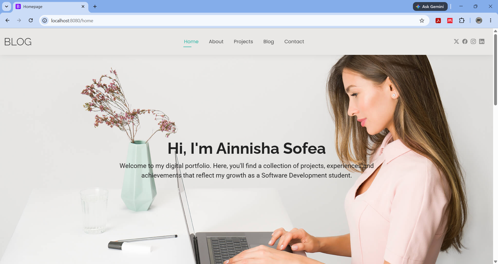
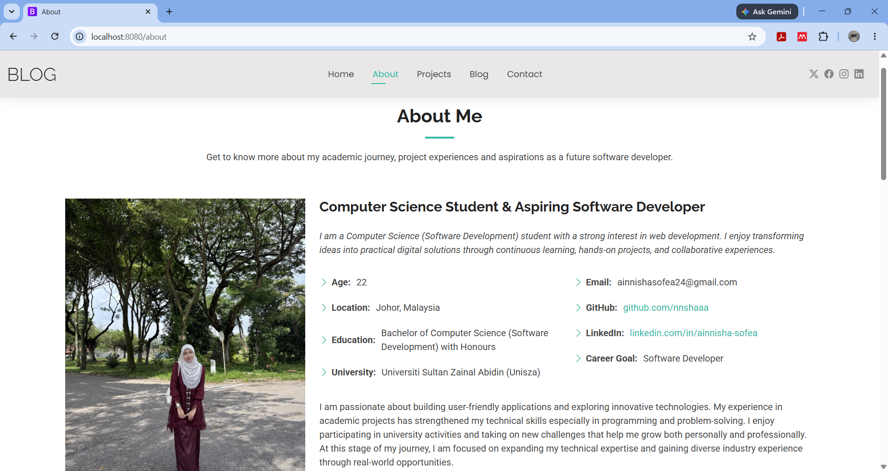
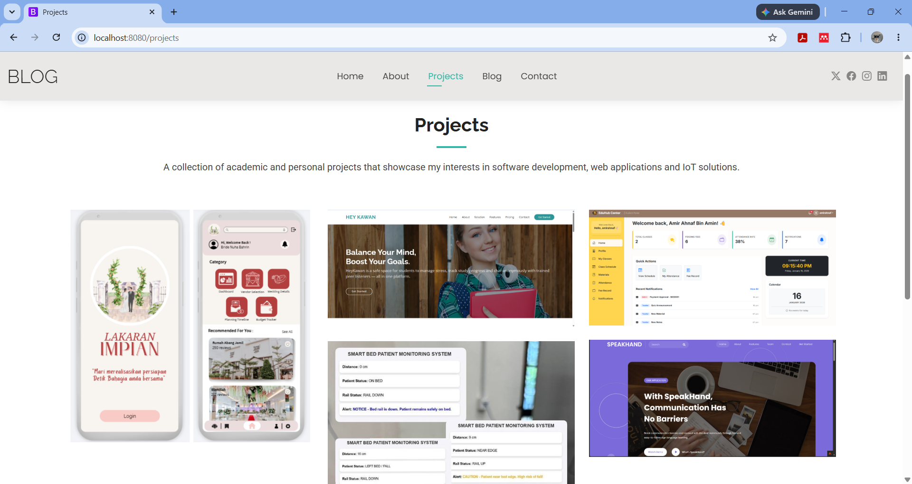
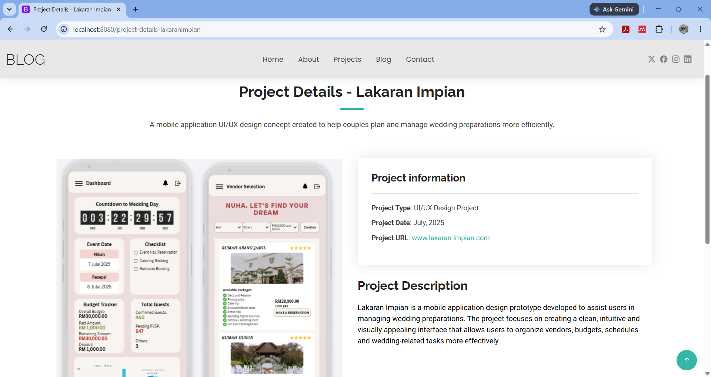
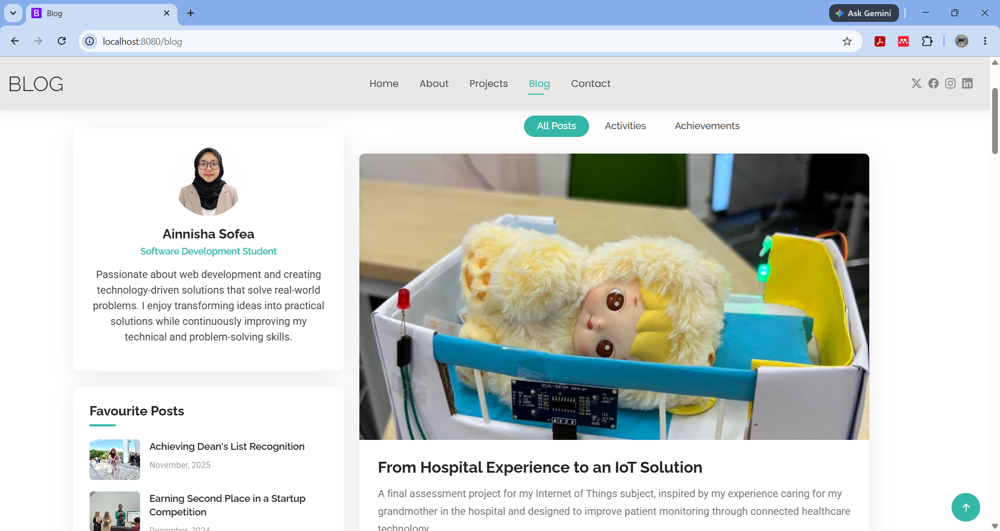
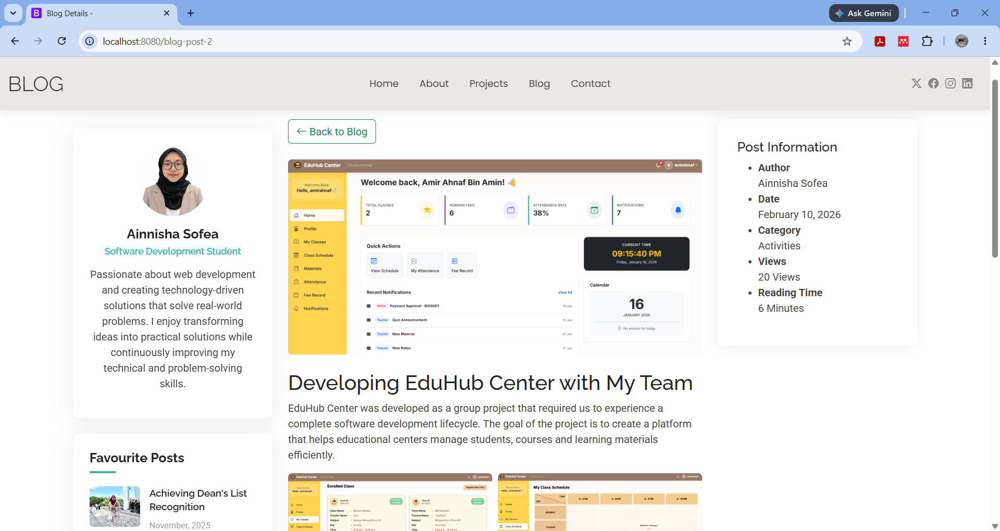
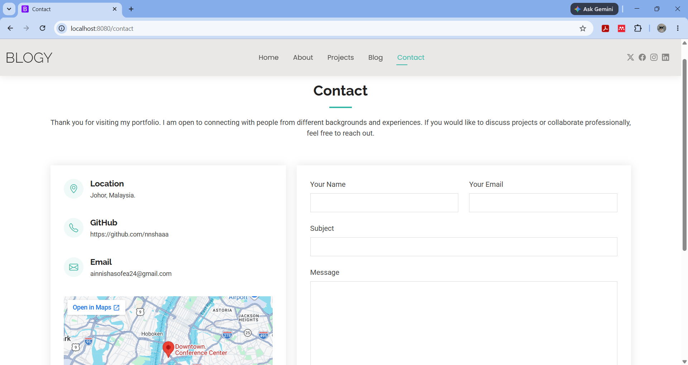

# Personal Blog Portfolio

## Description

Personal portfolio website developed using CodeIgniter 4, HTML, CSS, JavaScript and Bootstrap. This portfolio showcases my academic projects, achievements, technical skills and learning journey as a Software Development student.

## Features

* Responsive portfolio website
* Home page introduction
* About Me section
* Project showcase with detailed project pages
* Blog page with category filtering
* Blog post detail pages
* Contact page
* Responsive navigation menu

## Technologies Used

* CodeIgniter 4
* PHP
* HTML5
* CSS
* JavaScript
* Bootstrap 5
* Git & GitHub

## Screenshots

### Home Page



### About Page



### Projects Page



### Project Details Page



### Blog Page



### Blog Post Page



### Contact Page



## How to Run the Project

1. Clone the repository

```bash
git clone https://github.com/nnshaaa/personal-blog-portfolio.git
```

2. Open the project folder

3. Install dependencies

```bash
composer install
```

4. Configure the project environment if needed

5. Start the development server

```bash
php spark serve
```

6. Open in your browser

```text
http://localhost:8080
```

## Demo Link

Portfolio Website:
(Not deployed yet)

GitHub Repository:
https://github.com/nnshaaa/personal-blog-portfolio

## Author

AINNISHA SOFEA BINTI AZAHAN
BACHELOR OF COMPUTER SCIENCE (SOFTWARE DEVELOPMENT) WITH HONOURS
UNIVERSITI SULTAN ZAINAL ABIDIN (UNISZA)
